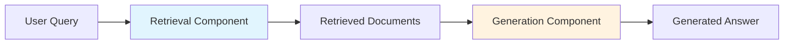

# RAG Validation: A Comprehensive Guide

> **Retrieval-Augmented Generation (RAG) Evaluation and Benchmarking**

This guide covers everything you need to know about validating RAG systems, from core metrics to production-ready CI/CD pipelines.

---

## 📚 Table of Contents

1. [Introduction to RAG Validation](#introduction-to-rag-validation)
2. [RAG Evaluation Metrics](#rag-evaluation-metrics)
3. [Validation Frameworks](#validation-frameworks)
4. [Retrieval Accuracy Assessment](#retrieval-accuracy-assessment)
5. [Answer Relevance Scoring](#answer-relevance-scoring)
6. [Benchmark Datasets for RAG](#benchmark-datasets-for-rag)
7. [Practical Implementation](#practical-implementation)
8. [GitHub Actions CI/CD Integration](#github-actions-cicd-integration)
9. [References and Resources](#references-and-resources)

---

## Introduction to RAG Validation

### What is RAG Validation?

RAG validation is the systematic process of evaluating how well a Retrieval-Augmented Generation system performs across two critical dimensions:

1. **Retrieval Quality**: How effectively the system finds relevant context from a knowledge base
2. **Generation Quality**: How accurately and helpfully the LLM synthesizes answers using retrieved context



### Why RAG Validation Matters

| Challenge | Impact | Solution |
|-----------|--------|----------|
| Hallucinations | Misleading users | Ground truth evaluation |
| Retrieval gaps | Missing information | Recall metrics |
| Context overload | Diluted responses | Precision metrics |
| Answer drift | Off-topic responses | Relevance scoring |
| Latency issues | Poor UX | Performance benchmarks |

---

## RAG Evaluation Metrics

### 1. Retrieval Metrics

#### Context Recall
Measures whether all relevant information needed to answer the query was retrieved.

$$\text{Context Recall} = \frac{|\text{Ground Truth} \cap \text{Retrieved}|}{|\text{Ground Truth}|}$$

**Example:**
- Ground truth contains 5 critical facts
- Retrieved documents contain 4 of those facts
- **Context Recall = 4/5 = 0.80**

#### Context Precision
Measures the signal-to-noise ratio in retrieved documents.

$$\text{Context Precision} = \frac{|\text{Relevant Retrieved}|}{|\text{Total Retrieved}|}$$

**Example:**
- Retrieved 10 chunks
- Only 6 are relevant to the query
- **Context Precision = 6/10 = 0.60**

#### Mean Reciprocal Rank (MRR)
Evaluates the ranking quality of retrieved documents.

$$\text{MRR} = \frac{1}{|Q|} \sum_{i=1}^{|Q|} \frac{1}{\text{rank}_i}$$

**Example:**
- Query 1: First relevant doc at position 2 → 1/2 = 0.5
- Query 2: First relevant doc at position 1 → 1/1 = 1.0
- Query 3: First relevant doc at position 4 → 1/4 = 0.25
- **MRR = (0.5 + 1.0 + 0.25) / 3 = 0.583**

#### Normalized Discounted Cumulative Gain (nDCG)
Measures ranking quality with graded relevance.

$$\text{DCG} = \sum_{i=1}^{p} \frac{2^{rel_i} - 1}{\log_2(i+1)}$$

### 2. Generation Metrics

#### Faithfulness
Measures whether the generated answer is factually consistent with retrieved context.

$$\text{Faithfulness} = \frac{\text{Claims Supported by Context}}{\text{Total Claims in Answer}}$$

**Evaluation approaches:**
- **LLM-as-Judge**: Use a strong LLM to verify each claim
- **NLI Models**: Natural Language Inference models (entailment/contradiction)
- **Human Evaluation**: Expert annotators verify factual consistency

#### Answer Relevance
Measures how well the answer addresses the original question.

$$\text{Answer Relevance} = \cos(\text{Query Embedding}, \text{Answer Embedding})$$

**Or via LLM evaluation:**
- Does the answer directly address the question?
- Is there extraneous information?
- Is the answer complete?

#### Answer Correctness
Compares generated answer against ground truth.

**Metrics:**
- **Exact Match (EM)**: Binary match with reference
- **F1 Score**: Token-level precision/recall balance
- **BERTScore**: Semantic similarity using contextual embeddings
- **BLEU/ROUGE**: N-gram overlap metrics

### 3. End-to-End Metrics

#### RAGAS Score
Composite metric combining multiple dimensions.

```
RAGAS Score = (Faithfulness + Answer Relevance + Context Precision + Context Recall) / 4
```

#### Custom Business Metrics

| Metric | Description | Measurement |
|--------|-------------|-------------|
| User Satisfaction | Direct user feedback | Thumbs up/down |
| Query Success Rate | Successfully answered queries | % of queries with good answers |
| Escalation Rate | Transfers to human support | % of queries escalated |
| Latency | Time to answer | P50, P95, P99 percentiles |

---

## Validation Frameworks

### 1. RAGAS (Retrieval-Augmented Generation Assessment)

The most popular open-source framework for RAG evaluation.

**Features:**
- Component-wise and end-to-end metrics
- Synthetic test data generation
- LLM-based evaluation

```python
from ragas import evaluate
from ragas.metrics import (
    faithfulness,
    answer_relevancy,
    context_recall,
    context_precision,
)

# Evaluate your RAG pipeline
results = evaluate(
    dataset=eval_dataset,
    metrics=[
        context_precision,
        context_recall,
        faithfulness,
        answer_relevancy,
    ],
)
```

### 2. ARES (Automated RAG Evaluation System)

Uses synthetic data generation and LLM judges.

**Pipeline:**
1. Generate synthetic queries from documents
2. Generate synthetic answers
3. Train LLM judges for each metric
4. Evaluate production queries

### 3. TruLens

Provides instrumentation and feedback for RAG applications.

**Key Features:**
- Real-time monitoring
- Feedback functions (groundedness, relevance)
- Integration with LangChain, LlamaIndex

```python
from trulens_eval import TruChain, Feedback
from trulens_eval.feedback import Groundedness

grounded = Groundedness()
f_groundedness = (
    Feedback(grounded.groundedness_measure)
    .on(TruChain.select_context().collate())
    .on_output()
)
```

### 4. Continuous Evaluation (CI/CD)

| Framework | Best For | Integration |
|-----------|----------|-------------|
| RAGAS | Research, comprehensive evaluation | Python SDK |
| ARES | Synthetic data generation | Python SDK |
| TruLens | Production monitoring | LangChain, LlamaIndex |
| Giskard | Bias detection, security | Python SDK |
| UpTrain | Real-time monitoring | API, SDK |

---

## Retrieval Accuracy Assessment

### What Makes Good Retrieval?

```
┌─────────────────────────────────────────────────────────────┐
│                    Retrieval Quality                        │
├─────────────────────────────────────────────────────────────┤
│  ┌──────────────┐  ┌──────────────┐  ┌──────────────┐     │
│  │  Relevance   │  │   Coverage   │  │    Rank      │     │
│  │   (Precision)│  │   (Recall)   │  │   (Order)    │     │
│  └──────────────┘  └──────────────┘  └──────────────┘     │
└─────────────────────────────────────────────────────────────┘
```

### Chunking Strategy Evaluation

Different chunking approaches affect retrieval quality:

| Strategy | Best For | Trade-off |
|----------|----------|-----------|
| Fixed-size (512 tokens) | General purpose | May split semantic units |
| Semantic (sentences) | Preserves meaning | Variable chunk sizes |
| Recursive | Hierarchical docs | Complex implementation |
| Agentic | Dynamic content | Higher compute cost |

### Embedding Model Comparison

Benchmark performance on retrieval tasks:

```python
# Example: Compare embedding models
models = [
    "sentence-transformers/all-MiniLM-L6-v2",
    "BAAI/bge-large-en",
    "openai/text-embedding-3-large",
    "cohere/embed-english-v3",
]

# Evaluate on your domain-specific dataset
for model in models:
    recall = evaluate_retrieval(model, test_queries)
    print(f"{model}: {recall:.3f}")
```

### Query Expansion Techniques

| Technique | Description | When to Use |
|-----------|-------------|-------------|
| HyDE | Hypothetical document embedding | Short queries |
| Multi-query | Generate query variations | Complex topics |
| Step-back | Abstract then retrieve | Technical questions |
| RAG-Fusion | Reciprocal rank fusion | Multiple aspects |

### Retrieval Configuration Testing

```yaml
# retrieval_config.yaml
experiments:
  - name: baseline
    top_k: 5
    similarity_threshold: 0.7
    reranking: false
    
  - name: with_rerank
    top_k: 20
    similarity_threshold: 0.5
    reranking: true
    reranker: cohere/rerank-english-v2
    final_k: 5
```

---

## Answer Relevance Scoring

### Dimensions of Relevance

```
        ┌─────────────────────────────────────┐
        │         Answer Quality              │
        └─────────────────────────────────────┘
                      │
        ┌─────────────┼─────────────┐
        ▼             ▼             ▼
   ┌─────────┐  ┌─────────┐  ┌─────────┐
   │ Context │  │ Query   │  │ Comple- │
   │ Ground- │  │ Align-  │  │ teness  │
   │ edness  │  │ ment    │  │         │
   └─────────┘  └─────────┘  └─────────┘
```

### Automated Scoring Methods

#### 1. LLM-as-Judge (GPT-4, Claude, etc.)

```python
RELEVANCE_PROMPT = """
Rate the relevance of the following answer to the query.

Query: {query}
Answer: {answer}

Rate on a scale of 1-5:
1 - Completely irrelevant
2 - Mostly irrelevant
3 - Partially relevant
4 - Mostly relevant
5 - Highly relevant

Provide your rating and a brief justification.
"""
```

#### 2. Embedding Similarity

```python
from sentence_transformers import SentenceTransformer

model = SentenceTransformer('all-MiniLM-L6-v2')

def relevance_score(query: str, answer: str) -> float:
    query_emb = model.encode(query)
    answer_emb = model.encode(answer)
    return cosine_similarity([query_emb], [answer_emb])[0][0]
```

#### 3. Cross-Encoder Re-ranking

```python
from sentence_transformers import CrossEncoder

model = CrossEncoder('cross-encoder/ms-marco-MiniLM-L-6-v2')
score = model.predict([(query, answer)])
```

### Human Evaluation Rubric

| Score | Criteria |
|-------|----------|
| 5 | Answer completely addresses the query with no irrelevant information |
| 4 | Answer mostly addresses the query with minor gaps or slight irrelevance |
| 3 | Answer partially addresses the query with noticeable gaps |
| 2 | Answer barely addresses the query, mostly irrelevant |
| 1 | Answer is completely irrelevant or unhelpful |

---

## Benchmark Datasets for RAG

### General-Purpose Benchmarks

| Dataset | Size | Domain | Metrics |
|---------|------|--------|---------|
| **Natural Questions** | 300K+ | Wikipedia | EM, F1 |
| **TriviaQA** | 650K+ | Trivia | EM, F1 |
| **MS MARCO** | 1M+ | Web search | MRR, NDCG |
| **HotpotQA** | 113K | Multi-hop reasoning | EM, F1 |
| **BEIR** | 18 datasets | Diverse | nDCG@10 |

### Domain-Specific Benchmarks

| Dataset | Domain | Description |
|---------|--------|-------------|
| **PubMedQA** | Biomedical | Medical question answering |
| **FinQA** | Finance | Financial reasoning |
| **TechQA** | Technical | Enterprise support tickets |
| **SCIQ** | Science | Science exam questions |

### Creating Custom Benchmarks

```python
# custom_benchmark.py
benchmark = [
    {
        "query": "What is the refund policy?",
        "ground_truth_context": ["doc_001", "doc_042"],
        "ground_truth_answer": "Returns accepted within 30 days with receipt.",
        "category": "policies",
        "difficulty": "easy"
    },
    # ... more test cases
]
```

### Synthetic Data Generation

```python
from ragas.testset.generator import TestsetGenerator
from ragas.testset.evolutions import simple, reasoning, multi_context

# Generate test set from your documents
generator = TestsetGenerator.from_langchain(
    generator_llm,
    critic_llm,
    embeddings
)

testset = generator.generate(
    documents,
    test_size=100,
    distributions={
        simple: 0.5,
        reasoning: 0.3,
        multi_context: 0.2
    }
)
```

---

## Practical Implementation

### Project Structure

```
rag-validation/
├── .github/
│   └── workflows/
│       └── rag-evaluation.yml    # CI/CD pipeline
├── data/
│   ├── documents/                 # Knowledge base
│   └── benchmarks/               # Test datasets
├── src/
│   ├── rag_pipeline.py           # Your RAG implementation
│   ├── metrics.py                # Custom metrics
│   └── evaluation.py             # Evaluation runner
├── tests/
│   ├── test_retrieval.py
│   └── test_generation.py
├── config/
│   └── eval_config.yaml
├── requirements.txt
└── README.md
```

### Running Evaluations

```bash
# Install dependencies
pip install -r requirements.txt

# Run full evaluation
python -m src.evaluation --config config/eval_config.yaml

# Run specific metric
python -m src.evaluation --metric context_recall

# Generate report
python -m src.evaluation --output report.html
```

### Interpreting Results

```
╔═══════════════════════════════════════════════════════╗
║           RAG Evaluation Report                       ║
╠═══════════════════════════════════════════════════════╣
║  Context Precision:  0.78  ████████████████████░░   ║
║  Context Recall:     0.85  █████████████████████░   ║
║  Faithfulness:       0.91  ██████████████████████   ║
║  Answer Relevance:   0.82  ████████████████████░░   ║
╠═══════════════════════════════════════════════════════╣
║  Overall RAGAS:      0.84  ████████████████████░    ║
╚═══════════════════════════════════════════════════════╝
```

---

## GitHub Actions CI/CD Integration

See [`.github/workflows/rag-evaluation.yml`](.github/workflows/rag-evaluation.yml) for the complete workflow.

### Quick Setup

1. **Add secrets** to your repository:
   - `OPENAI_API_KEY` - For LLM-based evaluation
   - `LANGCHAIN_API_KEY` - For LangSmith tracing (optional)

2. **Trigger evaluation** on:
   - Pull requests (changed RAG components)
   - Scheduled runs (daily/weekly regression tests)
   - Manual dispatch (ad-hoc testing)

3. **View results** in:
   - PR comments (automated reports)
   - Actions artifacts (detailed logs)
   - GitHub Pages (historical trends)

### Workflow Features

- **Caching**: Vector stores and embeddings cached between runs
- **Parallelization**: Test multiple configurations simultaneously
- **Thresholds**: Fail builds on regression
- **Reporting**: Markdown summaries posted to PRs

---

## References and Resources

### Papers

1. **RAGAS**: Es et al. (2023) - [arXiv:2309.15217](https://arxiv.org/abs/2309.15217)
2. **ARES**: Saad-Falcon et al. (2023) - [arXiv:2311.09476](https://arxiv.org/abs/2311.09476)
3. **Self-RAG**: Asai et al. (2023) - [arXiv:2310.11511](https://arxiv.org/abs/2310.11511)
4. **Corrective RAG**: Yan et al. (2024) - [arXiv:2401.15884](https://arxiv.org/abs/2401.15884)

### Frameworks & Tools

| Tool | Link | Description |
|------|------|-------------|
| RAGAS | [docs.ragas.io](https://docs.ragas.io) | Comprehensive RAG evaluation |
| TruLens | [trulens.org](https://www.trulens.org) | RAG instrumentation |
| ARES | [github.com/stanford-futuredata/ares](https://github.com/stanford-futuredata/ares) | Synthetic evaluation |
| Giskard | [giskard.ai](https://www.giskard.ai) | AI model testing |
| LangSmith | [smith.langchain.com](https://smith.langchain.com) | LLM observability |

### Best Practices

1. **Start Simple**: Begin with basic metrics (precision, recall) before complex ones
2. **Domain Matters**: Use domain-specific benchmarks, not just general ones
3. **Human in the Loop**: Validate automated metrics with human judgment
4. **Monitor Trends**: Track metrics over time, not just point-in-time
5. **A/B Test**: Compare RAG configurations systematically

---

## Quick Start

```bash
# Clone and setup
git clone <repo-url>
cd rag-validation
pip install -r requirements.txt

# Run example evaluation
python examples/basic_evaluation.py

# Run with GitHub Actions
# Push to trigger automatic evaluation
```

---

*Last updated: July 2026*

*For questions or contributions, please open an issue or PR.*
