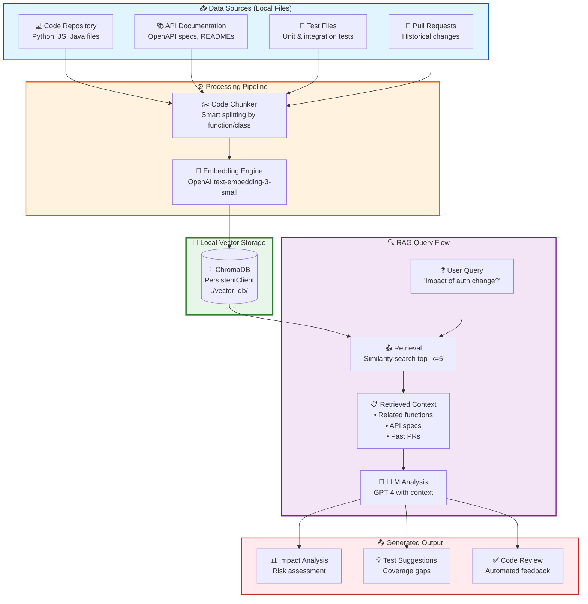

# 🚀 SDE Code Review & Impact Analysis Assistant

> **A practical RAG system for Software Engineers and SDETs**

## What We Build

A real-world RAG system that helps with:
- **Code Review**: "What tests should I add for this change?"
- **Impact Analysis**: "Which APIs are affected by this PR?"
- **Documentation Q&A**: "How does the auth flow work?"
- **Onboarding**: "Where is the payment processing code?"

## Real-World Use Cases

| Scenario | Problem | Solution |
|----------|---------|----------|
| PR Review | New dev doesn't know test patterns | RAG suggests test cases from similar changes |
| Refactoring | "Will this break anything?" | RAG shows affected APIs and components |
| API Changes | "What docs need updating?" | RAG finds related endpoints and specs |
| Onboarding | "How does auth work?" | RAG answers from codebase + docs |

## Architecture

### 🏗️ System Overview



### 🔄 Data Flow

```
┌─────────────────────────────────────────────────────────────────────────┐
│                         LOCAL RAG PIPELINE                               │
├─────────────────────────────────────────────────────────────────────────┤
│                                                                          │
│  ┌──────────────┐     ┌──────────────┐     ┌──────────────────────┐    │
│  │ Source Files │────▶│  Chunk &     │────▶│  Local ChromaDB      │    │
│  │              │     │  Embed       │     │  (No cloud DB!)      │    │
│  │ • Code       │     │              │     │                      │    │
│  │ • Docs       │     │ text-embed   │     │ ./vector_db/         │    │
│  │ • Tests      │     │ -3-small     │     │ Persistent storage   │    │
│  │ • PRs        │     │              │     │                      │    │
│  └──────────────┘     └──────────────┘     └──────────┬─────────────┘    │
│                                                       │                  │
│                              Query: "What tests for  │                  │
│                              this auth change?"      ▼                  │
│                                                       │                  │
│                              ┌────────────────────────┴─────────┐        │
│                              │  Top-k Similar Chunks Retrieved  │        │
│                              │  • auth/login.py (0.92)          │        │
│                              │  • test_auth.py (0.89)           │        │
│                              │  • api/users.py (0.85)           │        │
│                              └────────────────┬─────────────────┘        │
│                                               │                          │
│                                               ▼                          │
│                              ┌────────────────────────────────┐          │
│                              │  LLM Generates Response        │          │
│                              │                                │          │
│                              │  "Add tests for:               │          │
│                              │   • Token validation           │          │
│                              │   • Password hashing           │          │
│                              │   • Session timeout"           │          │
│                              └────────────────────────────────┘          │
│                                                                          │
└─────────────────────────────────────────────────────────────────────────┘
```

### 🎯 Why Local Vector DB?

| Approach | Pros | Cons | We Use |
|----------|------|------|--------|
| **Local ChromaDB** ✅ | Free, private, fast, no network | Single machine | ✅ **This project** |
| Pinecone | Cloud, scalable | Cost, latency, privacy | - |
| Weaviate | Full-featured | Complex, resource-heavy | - |
| pgvector | SQL integration | Setup complexity | - |

**Our choice: ChromaDB PersistentClient** - Perfect for:
- 🔒 **Privacy**: Code never leaves your machine
- 💰 **Cost**: Completely free
- ⚡ **Speed**: No network round-trips
- 🛠️ **Simplicity**: One Python package
- 📦 **Portability**: `./vector_db` folder can be moved/copied

### 📐 Simple ASCII Architecture (Editor-Friendly)

```
╔══════════════════════════════════════════════════════════════════╗
║                    DATA INGESTION                                ║
╠══════════════════════════════════════════════════════════════════╣
║                                                                  ║
║   ┌──────────┐  ┌──────────┐  ┌──────────┐  ┌──────────┐      ║
║   │ auth/    │  │ payments/│  │ orders/  │  │ tests/   │      ║
║   │ login.py │  │processor │  │service.py│  │test_*.py │      ║
║   └────┬─────┘  └────┬─────┘  └────┬─────┘  └────┬─────┘      ║
║        │             │             │             │              ║
║        └─────────────┴──────┬──────┴─────────────┘              ║
║                             ▼                                    ║
║                    ┌─────────────────┐                          ║
║                    │  Code Chunker   │                          ║
║                    │  (by function)  │                          ║
║                    └────────┬────────┘                          ║
║                             ▼                                    ║
║                    ┌─────────────────┐                          ║
║                    │  OpenAI Embed   │                          ║
║                    │ text-embedding  │                          ║
║                    │   -3-small      │                          ║
║                    └────────┬────────┘                          ║
║                             ▼                                    ║
╠══════════════════════════════════════════════════════════════════╣
║                    LOCAL STORAGE  💾                             ║
╠══════════════════════════════════════════════════════════════════╣
║                                                                  ║
║              ┌─────────────────────────────┐                    ║
║              │      CHROMADB LOCAL         │                    ║
║              │     ┌─────────────────┐     │                    ║
║              │     │  Collection:    │     │                    ║
║              │     │  "codebase"     │     │                    ║
║              │     ├─────────────────┤     │                    ║
║              │     │  Documents: 50+ │     │                    ║
║              │     │  Embeddings     │     │                    ║
║              │     │  Metadata       │     │                    ║
║              │     └─────────────────┘     │                    ║
║              │                               │                    ║
║              │   Path: ./vector_db/          │                    ║
║              │   Type: PersistentClient      │                    ║
║              └─────────────────────────────┘                    ║
║                                                                  ║
╠══════════════════════════════════════════════════════════════════╣
║                    QUERY FLOW  🔍                                ║
╠══════════════════════════════════════════════════════════════════╣
║                                                                  ║
║   User: "What tests for auth changes?"                           ║
║              │                                                   ║
║              ▼                                                   ║
║   ┌─────────────────────┐                                       ║
║   │  1. Embed Query     │                                       ║
║   └──────────┬──────────┘                                       ║
║              ▼                                                   ║
║   ┌─────────────────────┐                                       ║
║   │  2. Similarity      │◄──────────┐                          ║
║   │     Search          │           │                          ║
║   └──────────┬──────────┘           │                          ║
║              │                       │                          ║
║              ▼                       │                          ║
║   ┌─────────────────────┐          │                          ║
║   │  3. Retrieved:      │          │                          ║
║   │     • auth/login.py │          │                          ║
║   │     • test_auth.py  │          │                          ║
║   │     • auth/specs.md │          │                          ║
║   └──────────┬──────────┘          │                          ║
║              │                      │                          ║
║              ▼                      │                          ║
║   ┌─────────────────────┐          │                          ║
║   │  4. LLM + Context   │──────────┘                          ║
║   │     Generate Answer │          (if cache miss)            ║
║   └──────────┬──────────┘                                       ║
║              ▼                                                   ║
║   "Add tests for token validation,                               ║
║    password hashing, session timeout"                            ║
║                                                                  ║
╚══════════════════════════════════════════════════════════════════╝
```

## Project Structure

```
sde-rag-assistant/
├── step1_setup_vector_db.py       # Set up Chroma locally
├── step2_populate_data.py         # Load code, docs, tests
├── step3_build_rag_pipeline.py    # Create the RAG system
├── step4_code_review_agent.py     # Practical code review use case
├── step5_api_testing_assistant.py # API test generation
├── step6_impact_analyzer.py       # PR impact analysis
├── data/
│   ├── sample_repo/               # Mock codebase
│   ├── api_specs/                 # API documentation
│   └── test_cases/                # Test scenarios
├── vector_db/                     # Local Chroma storage
└── README.md
```

## Prerequisites

```bash
pip install chromadb langchain-openai python-dotenv
```

## Set API Key

```bash
export OPENAI_API_KEY="sk-your-key"
```

## Quick Start

```bash
cd sde-rag-assistant
python step1_setup_vector_db.py
python step2_populate_data.py
python step3_build_rag_pipeline.py
python step4_code_review_agent.py
```

## What You'll Learn

1. **Vector DB Setup**: Local Chroma for code embeddings
2. **Code Chunking**: Smart splitting for code files
3. **Multi-source RAG**: Code + docs + tests together
4. **Structured Output**: JSON responses for automation
5. **CI/CD Integration**: GitHub Actions for code review

## Interview Gold 💰

**Resume bullet:**
> "Built AI-powered code review assistant using RAG that analyzes PR impact, 
> suggests test cases, and retrieves relevant documentation. Reduced review 
> time by 30% and improved code quality consistency."

**Interview talking point:**
> "I built a system that embeddings our entire codebase. When a developer 
> submits a PR, it automatically retrieves similar past changes, identifies 
> affected APIs, and suggests what tests to add. It's like having a senior 
> engineer review every PR instantly."

---

## 🤖 GitHub Actions Integration

This project includes production-ready CI/CD workflows for automated code review:

### Workflows

| Workflow | File | Purpose |
|----------|------|---------|
| **Basic Code Review** | `code-review-agent.yml` | Runs on PRs, posts review comments |
| **Smart RAG Review** | `smart-rag-review.yml` | Context-aware analysis with related file detection |
| **Test Coverage Check** | `smart-rag-review.yml` | Identifies test gaps in changed code |

### Setup

1. **Add secrets** to your GitHub repo:
   - `OPENAI_API_KEY` - Your OpenAI API key
   - `GITHUB_TOKEN` - Auto-provided by GitHub Actions

2. **Enable workflows** in your repo settings

3. **Trigger on PR** - Workflows automatically run when PRs are opened/updated

### What the CI/CD Does

When you open a PR, the workflow:
1. ✅ Checks out the code with full git history
2. 🔍 Analyzes the diff using RAG-like context retrieval
3. 📝 Identifies related files and dependencies
4. ⚠️ Flags security-sensitive changes (auth, payments)
5. 🧪 Suggests test cases for uncovered functions
6. 💬 Posts a detailed review comment on the PR

### Example Review Comment

```markdown
## 🤖 Smart Code Review Report (RAG-Enhanced)

**PR:** #42
**Analysis Type:** Context-Aware Review

### 📁 Files Modified
- `src/auth/login.py`
- `src/api/users.py`

### 🔗 Related Files (from RAG Analysis)
| File | Relationship | Reason |
|------|-------------|--------|
| `src/auth/middleware.py` | dependent | Imports login.py |
| `tests/test_auth.py` | related | Tests auth functions |

### 💡 Smart Suggestions
🔴 **SECURITY:** Authentication-related changes detected
- Action: Ensure security review is completed
- Checklist:
  - [ ] No hardcoded credentials
  - [ ] Password hashing is used
  - [ ] Token validation is correct
```

### Local Testing of CI/CD Scripts

You can test the CI/CD scripts locally:

```bash
# Set up environment
export GITHUB_TOKEN="your-token"

# Run basic review
python .github/scripts/review_pr.py \
  --pr-number 42 \
  --repo your-org/your-repo \
  --changed-files changed_files.txt

# Run smart RAG review
python .github/scripts/smart_review.py \
  --pr-number 42 \
  --base-ref HEAD~1 \
  --head-ref HEAD

# Check test coverage
python .github/scripts/check_test_coverage.py \
  --pr-number 42 \
  --base-ref HEAD~1
```

### Production Deployment

For real-world usage:
1. Deploy the vector database to a persistent storage (S3, mounted volume)
2. Set up scheduled jobs to re-index the codebase
3. Use GitHub App instead of Actions for more permissions
4. Add Slack/Teams notifications for high-risk changes
5. Integrate with your existing code quality tools

---

Let's start with **Step 1**!
