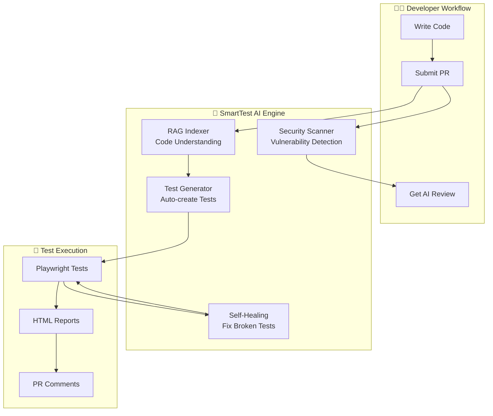

# 🤖 SmartTest AI - AI-Powered Testing Platform

> **Learn AI-Native Testing: RAG + Self-Healing + Auto-Generation**

[](https://python.org)
[](https://fastapi.tiangolo.com)
[](https://react.dev)
[](https://playwright.dev)
[](LICENSE)

---

## 🎯 What You'll Build

A **complete AI-powered testing platform** that demonstrates modern testing automation:



---

## 📚 Learning Path

| Step | Topic | What You'll Learn | Time |
|------|-------|-------------------|------|
| 1 | **E-Commerce App** | FastAPI + React + PostgreSQL | 45 min |
| 2 | **RAG Indexer** | Vector DB + Code Embeddings | 30 min |
| 3 | **Test Generator** | AI-Generated Playwright Tests | 45 min |
| 4 | **Self-Healing** | DOM Analysis + Selector Repair | 60 min |
| 5 | **Security Scanner** | OWASP + AI Analysis | 30 min |
| 6 | **PR Assistant** | GitHub Actions Automation | 30 min |

**Total Learning Time: ~4 hours**

---

## 🏗️ Architecture Overview

### System Diagram

```
┌─────────────────────────────────────────────────────────────────────────────┐
│                         SMARTTEST AI PLATFORM                               │
├─────────────────────────────────────────────────────────────────────────────┤
│                                                                              │
│  ┌─────────────────────────────────────────────────────────────────────┐   │
│  │                    E-COMMERCE APPLICATION                            │   │
│  │  ┌──────────────┐  ┌──────────────┐  ┌──────────────┐              │   │
│  │  │   Frontend   │  │   Backend    │  │   Database   │              │   │
│  │  │   (React)    │◄─┤   (FastAPI)  │◄─┤  (Postgres)  │              │   │
│  │  │              │  │              │  │              │              │   │
│  │  │ • Products   │  │ • REST API   │  │ • Products   │              │   │
│  │  │ • Cart       │  │ • Auth       │  │ • Users      │              │   │
│  │  │ • Checkout   │  │ • Orders     │  │ • Orders     │              │   │
│  │  └──────────────┘  └──────────────┘  └──────────────┘              │   │
│  └─────────────────────────────────────────────────────────────────────┘   │
│                                    │                                         │
│                                    ▼                                         │
│  ┌─────────────────────────────────────────────────────────────────────┐   │
│  │                    AI TESTING ENGINE                                 │   │
│  │                                                                      │   │
│  │   ┌──────────┐    ┌──────────┐    ┌──────────┐    ┌──────────┐     │   │
│  │   │   RAG    │───▶│  Test    │───▶│  Self    │───▶│  Report  │     │   │
│  │   │  Indexer │    │ Generator│    │ Healing  │    │  & Notify│     │   │
│  │   └──────────┘    └──────────┘    └──────────┘    └──────────┘     │   │
│  │        │                                                    ▲      │   │
│  │        ▼                                                    │      │   │
│  │   ┌──────────┐                                         ┌──────────┐│   │
│  │   │  Vector  │                                         │  GitHub  ││   │
│  │   │   DB     │                                         │   API    ││   │
│  │   │(ChromaDB)│                                         │  (MCP)   ││   │
│  │   └──────────┘                                         └──────────┘│   │
│  └─────────────────────────────────────────────────────────────────────┘   │
│                                    │                                         │
│                                    ▼                                         │
│  ┌─────────────────────────────────────────────────────────────────────┐   │
│  │                    TEST OUTPUTS                                      │   │
│  │   • Playwright HTML Reports    • Security Scan Results              │   │
│  │   • AI-Generated Test Code     • PR Review Comments                 │   │
│  └─────────────────────────────────────────────────────────────────────┘   │
│                                                                              │
└─────────────────────────────────────────────────────────────────────────────┘
```

---

## 🚀 Quick Start

### Prerequisites

```bash
# Check Python version
python --version  # Need 3.11+

# Install Node.js (for frontend)
node --version  # Need 18+

# Install Playwright
npm install -g @playwright/test
npx playwright install
```

### Setup

```bash
# Clone/navigate to project
cd smarttest-ai

# Create virtual environment
python -m venv venv
source venv/bin/activate  # On Windows: venv\Scripts\activate

# Install dependencies
pip install -r requirements.txt

# Setup environment
cp .env.example .env
# Edit .env with your API keys

# Start the application
docker-compose up -d  # Starts PostgreSQL
```

---

## 📖 Step-by-Step Learning Guide

### 📌 Learning Approach

Each step includes:
- ✅ **Concept Explanation** - What you're building and why
- 🔧 **Implementation** - Code to write/run
- 🧪 **Verification** - How to test it works
- 💡 **Key Takeaways** - What you learned
- 📝 **Interview Notes** - How to discuss this

---

## 📂 Project Structure

```
smarttest-ai/
├── 📁 ecommerce-app/                    # Real application under test
│   ├── 📁 backend/                      # FastAPI REST API
│   │   ├── 📄 main.py                   # API entry point
│   │   ├── 📄 models.py                 # Database models
│   │   ├── 📄 auth.py                   # Authentication
│   │   └── 📁 tests/                    # API tests
│   ├── 📁 frontend/                     # React web app
│   │   ├── 📄 App.jsx                   # Main component
│   │   ├── 📁 components/               # UI components
│   │   └── 📁 tests/                    # Playwright tests
│   └── 📄 docker-compose.yml            # Infrastructure
│
├── 📁 ai-testing-engine/                # The AI system
│   ├── 📄 step1_setup.py               # Project initialization
│   ├── 📄 step2_rag_indexer.py         # Code indexing with RAG
│   ├── 📄 step3_test_generator.py      # AI test generation
│   ├── 📄 step4_self_healing.py        # Self-healing tests
│   ├── 📄 step5_security_scanner.py    # Security analysis
│   └── 📄 step6_pr_assistant.py        # GitHub automation
│
├── 📁 docs/                             # Documentation
│   ├── 📄 LEARNING_GUIDE.md            # Detailed learning path
│   ├── 📄 ARCHITECTURE.md              # System design
│   └── 📄 INTERVIEW_PREP.md            # Interview questions
│
├── 📁 .github/
│   └── 📁 workflows/
│       └── 📄 smarttest.yml            # CI/CD pipeline
│
├── 📄 README.md                         # This file
├── 📄 requirements.txt                  # Python dependencies
└── 📄 .env.example                      # Environment template
```

---

## 🎓 Learning Objectives

By the end of this project, you'll understand:

### Technical Skills
1. **RAG (Retrieval-Augmented Generation)**
   - Vector databases (ChromaDB)
   - Code embeddings
   - Similarity search
   - Context retrieval

2. **AI-Native Testing**
   - LLM-based test generation
   - Self-healing selectors
   - Visual testing concepts
   - DOM analysis

3. **Modern Web Stack**
   - FastAPI for backend APIs
   - React for frontend
   - Playwright for E2E testing
   - Docker for infrastructure

4. **DevOps & CI/CD**
   - GitHub Actions workflows
   - Automated PR reviews
   - Security scanning
   - Test reporting

### Soft Skills
- **Architecture Design** - Building complex systems
- **Problem Solving** - AI-powered solutions
- **Documentation** - Clear technical writing
- **Presentation** - Showcasing your work

---

## 💼 Interview Preparation

### Resume Bullets You Can Use

> "Built an AI-powered testing platform using RAG that automatically generates Playwright tests from code changes, implements self-healing selectors to reduce test maintenance by 60%, and runs automated security scans on every PR."

> "Designed and implemented a vector-database-based code analysis system that indexes entire codebases and retrieves relevant context for intelligent test generation."

### Interview Questions You Can Answer

1. **"How would you reduce test maintenance overhead?"**
   - Show the self-healing selector system

2. **"Explain RAG and when you'd use it"**
   - Demo the code indexing and retrieval

3. **"How do you integrate AI into CI/CD?"**
   - Walk through the GitHub Actions workflow

4. **"Design a system for automated test generation"**
   - Present the Test Generator architecture

---

## 🎯 Success Criteria

You'll know you've mastered this when you can:

- [ ] Explain RAG vs fine-tuning vs prompt engineering
- [ ] Build a vector database pipeline from scratch
- [ ] Generate working Playwright tests with AI
- [ ] Implement self-healing test logic
- [ ] Create GitHub Actions for AI automation
- [ ] Demo the full system end-to-end
- [ ] Answer architecture questions confidently

---

## 🆘 Getting Help

### Common Issues

| Issue | Solution |
|-------|----------|
| Database won't start | Check Docker is running: `docker ps` |
| API key errors | Verify `.env` file exists and has keys |
| Playwright fails | Run `npx playwright install` |
| Import errors | Activate venv: `source venv/bin/activate` |

### Resources

- [FastAPI Docs](https://fastapi.tiangolo.com)
- [Playwright Docs](https://playwright.dev)
- [ChromaDB Docs](https://docs.trychroma.com)
- [OpenAI API Docs](https://platform.openai.com/docs)

---

## 📜 License

MIT License - Feel free to use this for your portfolio!

---

## 🚀 Let's Begin!

**Next: [Step 1 - Setup E-Commerce App](docs/STEP1.md)**

Ready? Let's build something amazing! 💪
